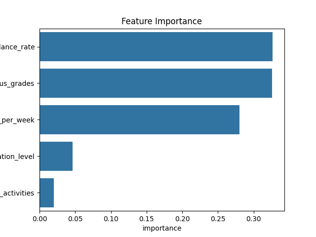

# 🎓 Prediksi Performa Siswa dengan Machine Learning

Sebuah proyek data science untuk memprediksi kelulusan siswa berdasarkan faktor-faktor penting seperti jam belajar, kehadiran, nilai sebelumnya, dan latar belakang pendidikan orang tua.

---

## 📌 Tujuan Proyek

✅ Menjelajahi dan memahami faktor-faktor yang berpengaruh terhadap kelulusan siswa  
✅ Melakukan pembersihan data dan eksplorasi visualisasi  
✅ Membangun model Machine Learning untuk prediksi kelulusan  
✅ Menginterpretasikan fitur-fitur terpenting yang mempengaruhi keputusan model

---

## 🗂️ Struktur Direktori Proyek

```
student-performance-prediction/
├── data/                  # Dataset mentah dan hasil pembersihan
├── notebooks/             # Notebook eksplorasi dan model
├── model/                # Model machine learning yang disimpan
├── images/                # Visualisasi penting seperti feature importance
├── requirements.txt       # Daftar library Python yang digunakan
└── README.md              # Deskripsi proyek
```

---

## 📊 Tentang Dataset

- 📌 Sumber: [Kaggle - Student Performance Prediction](https://www.kaggle.com/datasets/souradippal/student-performance-prediction)
- 📈 Jumlah data: 40.000 siswa
- 🎯 Target prediksi: `Passed` (Yes / No)
- 📋 Fitur: `Study Hours`, `Attendance Rate`, `Previous Grades`, `Extracurricular`, `Parent Education`, dll.

---

## 🧰 Teknologi & Tools

- Python 3.x
- Jupyter Notebook
- Pandas, NumPy, Seaborn, Matplotlib
- Scikit-learn
- Joblib (untuk simpan model)

---

## 🧠 Model Machine Learning

- 📚 Algoritma: `RandomForestClassifier`
- 🧪 Evaluasi: `Confusion Matrix`, `Classification Report`
- 💾 Output: Model disimpan dalam `models/student_pass_model.pkl`

---

## 🚀 Cara Menjalankan Proyek

1. Clone repositori ini:
   ```
   git clone https://github.com/username/student-performance-prediction.git
   ```
2. Masuk ke direktori dan install dependencies:
   ```
   pip install -r requirements.txt
   ```
3. Jalankan notebook:
   - `01_exploration.ipynb` untuk eksplorasi dan pembersihan
   - `02_model.ipynb` untuk training dan evaluasi model

---

## 🖼️ Visualisasi Penting

### 🔹 Feature Importance

Gambar berikut menunjukkan fitur-fitur paling berpengaruh terhadap prediksi kelulusan siswa:



**📌 Interpretasi:**
- Fitur seperti `previous_grades` dan `study_hours_per_week` punya pengaruh paling besar.
- Artinya, siswa dengan nilai bagus dan jam belajar tinggi cenderung lebih besar kemungkinannya untuk lulus.
- Fitur seperti `parent_education_level` berpengaruh lebih kecil menurut model.

---

## 🙋‍♂️ Tentang Pembuat

Created by **Gading Khairlambang** – aspiring data scientist 🚀

